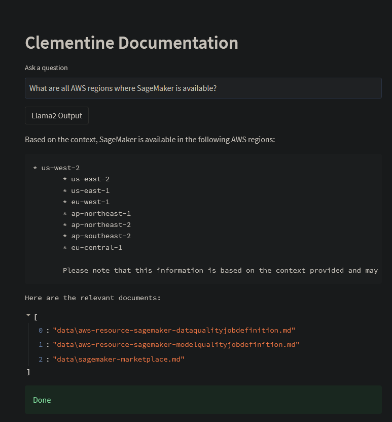
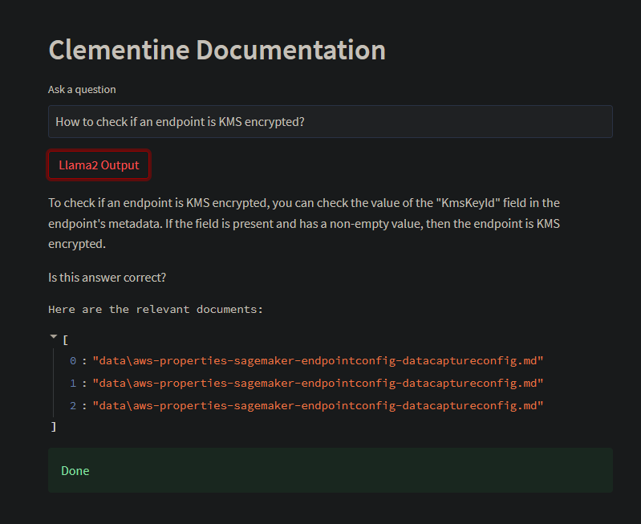
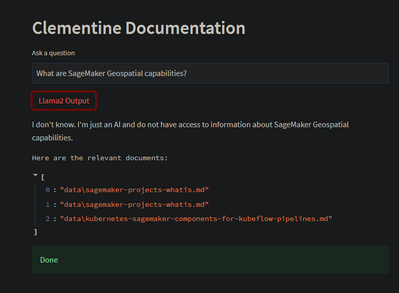

# Chatbot - Clementine project 

### Introduction

The idea is to build a RAG(Retrieval Augmented Generation) Chatbot that will answer the user question, and retrieve the relevant document. 

The RAG Chatbot works by taking a collection of Markdown files as input and, when asked a question, provides the corresponding answer based on the context provided by those files.

The MarkdownHandler component of the project loads Markdown pages from the data folder. It then divides these pages into smaller sections or chunks, calculates the embeddings (a numerical representation) of these sections with the RecursiveCharacterTextSplitter, and saves them in an embedding database called Chroma for later use.
When a user asks a question, the RAG ChatBot retrieves the most relevant sections from the Embedding database. The most relevant sections are then used as context to generate the final answer using a LLM. 

This project is made using AWS-Bedrock, LangChain, Chroma and Streamlit. As embedding model is used "amazon.titan-embed-text-v1", and as LLM "meta.llama2-13b-chat-v1"

### Running the application 
To execute the application on your local machine, utilize the following Docker commands:
```
   docker build -t aws-documentation .
   docker run -p 8501:8501 doc_chat
```
Then you can open http://localhost:8501 on your web browser.


### Application Screenshots
Here are some captures from where example questions are asked and their corresponding answers.







